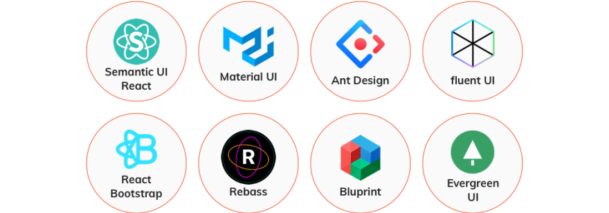

### React
> - Each part is an independent app
> - AI Assistant Job Flow Automator. 
> - Automate the customization of cover letters tailored to your resume and the unique requirements outlined in the job description extracted.

<div align="center">

<a href='https://www.hypech.com'>
</img></a>
<br></br>

[](https://www.python.org)
[](https://jupyterlab.readthedocs.io/en/stable)
[](https://www.tensorflow.org)
[](https://github.com/pre-commit/pre-commit)
[](https://github.com/psf/black)
[](http://www.pydocstyle.org/en/stable/)
[](https://www.gnu.org/licenses/gpl-3.0)
[](https://github.com/aiXpertLab/AI-Powered-Automatically-Customize-Cover-Letter/releases)
[](https://github.com/aixpertlab/)
 
[?style=for-the-badge>)](https://hypech.com)

[](https://www.linkedin.com/in/aiXpert)
[](https://twitter.com/aiXpertLab)
[](https://www.youtube.com/@aiXpertLab)
[](https://www.facebook.com/aiXpertLab/)
[](https://gmail.com)

</div> 

The AI-powered solution enables customers to integrate their specialized knowledge with OpenAI models to automate the extraction of relevant information from websites of their interest, effectively training the AI to deliver tailored results as if it were trained on their unique dataset.

1. [Create a React App](#CreateReact)
2. [Powered by Python](#architecture)
3. [Intuitive User Interface](#architecture)

You will get Unlock Your Personalized AI Assistant Effortlessly: Scrape, Upload, and Go.

# 1. Create React

Create a React App in local webserver. 
``` 
npm create vite@latest part1 -- --template react 
cd part1
npm install     //install all the dependencies in web server
npm run dev     //run webserver locally
```
</img></a>
When you use a fragment (<>...</>), React does not add any extra elements to the DOM, resulting in cleaner HTML output without additional nesting. However, when you don't use a fragment and don't provide a parent element explicitly, React automatically adds a `<div>` wrapper around the elements to satisfy the requirement of having a single parent element.

So, in terms of the resulting HTML structure, the only difference is the presence or absence of the `<div>` wrapper. Both approaches are valid, but using a fragment can lead to cleaner JSX code and simpler HTML output in certain situations.

### 1.1 JSX
It seems like React components are returning HTML markup. However, this is not the case. The layout of React components is mostly written using JSX. Although JSX looks like HTML, we are dealing with a way to write JavaScript. Under the hood, **JSX returned by React components is compiled into JavaScript **.

The compilation is handled by Babel. Projects created with create-react-app or vite are configured to compile automatically. 

In practice, JSX is much like HTML with the distinction that with JSX you can easily embed dynamic content by writing appropriate JavaScript within curly braces. The idea of JSX is quite similar to many templating languages, such as Thymeleaf used along with Java Spring, which are used on servers.

Writing components with React is easy, and by combining components, even a more complex application can be kept fairly maintainable. Indeed, a core philosophy of React is composing applications from many specialized reusable components.

### 1.2 props: passing data to components
Do not render objects.

### 1.3 Component state, event handlers
`import { useState } from 'react':` This line imports the useState **hook** from the react library.
``` 
const App = (props) => {
  const {counter} = props
  return (
    <div>{counter}</div>
  )} 

export default App
```
refactor:
```
const App = (props) => {
  const counter = props.counter; // Accessing the 'counter' property directly
  return (
    <div>{counter}</div>
  );
};
```

# 2. Communicating with server
```
const addNote = (event) => {
  event.preventDefault()
  console.log('button clicked', event.target)
}
```
The event parameter is the event that triggers the call to the event handler function:

The event handler immediately calls the event.preventDefault() method, which prevents the default action of submitting a form. The default action would, among other things, cause the page to reload.


# Technology Stack

1. OpenAI Assistant ChatGPT
2. Python
3. Selenium WebDriver

Selenium will facilitate various tasks such as navigating between pages, completing forms (e.g., login credentials), clicking links, and scrolling down. Apart from data scraping, Selenium will be instrumental in automating the outlined steps to manage actions until accessing the pages for data extraction. We will extract job offers and job descriptions.

Utilizing ChatGPT, known for its professional assistance, and leveraging your own resume as a knowledge base, ChatGPT will generate tailored resumes.

Python serves as the intermediary connecting the website, ChatGPT, and your personal information. Tkinter GUI is employed to provide a user-friendly interface.

# Quick start

1. Python 3.12.2
2. Selenium & chromedriver installed (watch how in this one).
https://chromedriver.chromium.org/

## Requirements

- `python-dotenv`
- `openai`
- `selenium`

------------------Video Instruction---------------------

[Yourtube](https://youtu.be/TlnytEi2lD8?si=jfcDj2MZqBptziZc)

```bash
pip install -r requirements.txt
```
# Part1

# Contribution

https://www.linkedin.com/pulse/automate-your-job-search-personalized-cover-letters-powered-leo-reny-elbye

> [!WARNING]  
> **Website Scraping Policy**
> 
> This project utilizes web scraping techniques to gather data from various websites. It's important to note that not all websites allow scraping, and some may have strict policies against it.
>
> **Before using this project**
>
> Take the time to carefully read and understand the scraping policies of each website from which you intend to scrape data. These policies can usually be found in the website's terms of service or robots.txt file.
>
> **Comply with Policies** 
>
>Ensure that you comply with the scraping policies of each website. Violating these policies could lead to consequences such as account restrictions, IP bans, or legal action.

> [!NOTE] 
> **Disclaimer**
> 
>This project is provided for general-purpose use, and we do not take responsibility for any consequences resulting from the misuse of web scraping techniques. Users are solely responsible for ensuring compliance with website scraping policies and any associated risks.

